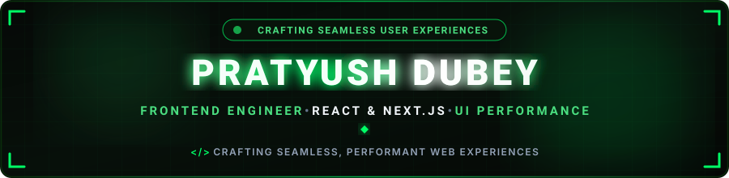

  

  
  &nbsp;
  
  &nbsp;
  

  

---

<h2 align="center">🟢 About Me</h2>

  

  

  Hey! I'm <b>Pratyush Dubey</b>, a passionate <b>Frontend Engineer & Computer Science Engineering student</b> based in India. 
  I specialize in building performant, scalable, and user-centric web applications with modern React ecosystems, state management, animations, 3D experiences, and clean frontend architecture.

  
  &nbsp;
  
  &nbsp;
  

  💬 <b>Let's Discuss:</b> React.js, Next.js, JavaScript, Tailwind CSS, Frontend Architecture, Animations & Performance. 
  ⚡ <b>Philosophy:</b> <i>"Building seamless experiences, one optimized render at a time."</i>

<table width="100%" border="0" align="center">
<tr>

<td width="50%" align="center" style="padding: 14px;">

<h4>🚀 Flagship Project</h4>

  <a href="https://portfolio-jet-ten-jjtyz5uxhe.vercel.app/" target="_blank">
    <b>Personal Developer Portfolio</b>
  </a>
   
  React, Tailwind CSS & Bootstrap

</td>

<td width="50%" align="center" style="padding: 14px;">

<h4>🍎 Signature UI Build</h4>

  <a href="https://apple-ui-six.vercel.app/" target="_blank">
    <b>Apple UI</b>
  </a>
   
  React, Three.js & Scroll Animations

</td>

</tr>

<tr>

<td width="50%" align="center" style="padding: 14px;">

<h4>🌐 Modern Landing Page</h4>

  <a href="https://nike-landing-page-one-rose.vercel.app/" target="_blank">
    <b>Modern Landing Page</b>
  </a>
   
  Next.js, Tailwind CSS & Framer Motion

</td>

<td width="50%" align="center" style="padding: 14px;">

<h4>🤝 Collaboration</h4>

  <b>Web & Frontend Engineering</b>
   
  Open to exciting new projects

</td>

</tr>
</table>

---

<h2 align="center">🟢 Featured Project Spotlight</h2>

<table width="100%" border="0" align="center">
<tr>

<td align="center" width="33%" style="padding: 20px;">

<h3>🖥️ Personal Developer Portfolio</h3>

  <i>
    A modern personal portfolio built with React, featuring a scalable
    component-based architecture and responsive UI with Tailwind CSS and Bootstrap.
  </i>

  

</td>

<td align="center" width="33%" style="padding: 20px;">

<h3>🍏 Apple UI</h3>

  <i>
    An Apple-inspired UI built with React and Three.js, featuring
    interactive 3D elements and smooth scroll animations.
  </i>

  

</td>

<td align="center" width="33%" style="padding: 20px;">

<h3>📈 Modern Landing Page</h3>

  <i>
    A modern landing page built with Next.js, featuring smooth Framer Motion
    animations, responsive design, and optimized frontend performance.
  </i>

  

</td>

</tr>
</table>

<b>🗂️ More Projects</b>

 

<b>Social Media Frontend</b> — React, Redux, WebRTC

A real-time social media interface with chat and video calling, built with Redux for global state management and WebRTC for peer-to-peer communication.

  

---

<h2 align="center">🛠️ Tech Stack & Skills</h2>

<b>Languages & Core Web</b>

  

<b>Frontend Frameworks & Libraries</b>

  

<b>State, Animation & Real-Time</b>

  
  &nbsp;
  
  &nbsp;
  
  &nbsp;
  

<b>Build Tools & Platforms</b>

  

  
  &nbsp;
  
  &nbsp;
  
  &nbsp;
  

---

<h2 align="center">📊 Most Used Technologies</h2>

  <i>Technologies used across my frontend projects</i>

  
  
  
  

  
  
  
  

  
  
  
  

  

---

<h2 align="center">📊 GitHub Analytics & Activity</h2>

<!-- YEAR-WISE COMMIT STATS -->

<table
  align="center"
  width="565"
  cellpadding="0"
  cellspacing="0"
  style="background:#041a0d; border:1px solid #0B3D0B; border-radius:10px; overflow:hidden;"
>

<tr>

<td
  align="center"
  width="50%"
  style="padding:22px 15px;"
>

  🔥 <b>2026 Commits</b>

<h1 style="margin:12px 0 0 0; color:#ffffff; font-size:34px;">
  866
</h1>

</td>

<td
  align="center"
  width="50%"
  style="padding:22px 15px; border-left:1px solid #0B3D0B;"
>

  📅 <b>2025 Commits</b>

<h1 style="margin:12px 0 0 0; color:#ffffff; font-size:34px;">
  207
</h1>

</td>

</tr>

</table>

 

<!-- CONTRIBUTION SUMMARY -->

<table
  align="center"
  width="565"
  cellpadding="0"
  cellspacing="0"
  style="background:#041a0d; border:1px solid #0B3D0B; border-radius:10px; overflow:hidden;"
>

<tr>

<td
  align="center"
  width="33.33%"
  style="padding:22px 10px;"
>

<h1 style="margin:0; color:#ffffff; font-size:30px;">
  1000+
</h1>

  <b>Total Commits</b>

  Nov 18, 2024 - Present

</td>

<td
  align="center"
  width="33.33%"
  style="padding:22px 10px; border-left:1px solid #0B3D0B;"
>

  24

  <b>Current Streak</b>

  Aug 27 - Sep 19

</td>

<td
  align="center"
  width="33.33%"
  style="padding:22px 10px; border-left:1px solid #0B3D0B;"
>

<h1 style="margin:0; color:#ffffff; font-size:30px;">
  38
</h1>

  <b>Longest Streak</b>

  Jul 11 - Aug 17

</td>

</tr>

</table>

 

  

---

<h2 align="center">⚡ Contribution Journey</h2>

  

---

<h2 align="center">📬 Let's Connect & Collaborate</h2>

  <i>
    Whether you want to discuss frontend architecture, React best practices,
    or just say hello — my inbox is always open!
  </i>

<table border="0" align="center">

<tr>

<td align="center" width="220" style="padding: 16px;">

<a href="https://linkedin.com/in/webdev-pratyush-dubey" target="_blank">

  

</a>

 

<b>Professional Network</b>

</td>

<td align="center" width="220" style="padding: 16px;">

<a href="mailto:pratyushdubey202004@gmail.com">

  

</a>

 

<b>Direct Collaboration</b>

</td>

<td align="center" width="220" style="padding: 16px;">

<a href="https://github.com/pratyush61" target="_blank">

  

</a>

 

<b>Code & Projects</b>

</td>

</tr>

</table>
