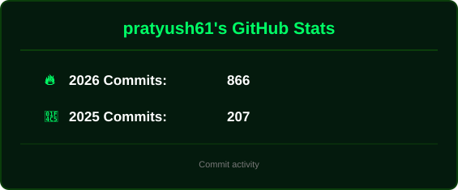

  

  
  &nbsp;
  
  &nbsp;
  

  

---

## 🟢 About Me

  

  

I'm **Pratyush Dubey**, a Frontend Engineer and Computer Science Engineering student based in India. I build performant, scalable, user-centric web applications using modern React ecosystems, state management, animation, 3D experiences, and clean frontend architecture.

  
  
  

**Let's discuss:** React.js · Next.js · JavaScript · Tailwind CSS · Frontend Architecture · Animation & Performance
**Philosophy:** *Building seamless experiences, one optimized render at a time.*

| 🚀 Flagship Project | 🍎 Signature UI Build |
|---|---|
| [**Personal Developer Portfolio**](https://portfolio-jet-ten-jjtyz5uxhe.vercel.app/) — React, Tailwind CSS & Bootstrap | [**Apple UI**](https://apple-ui-six.vercel.app/) — React, Three.js & Scroll Animations |
| **🌐 Modern Landing Page** | **🤝 Collaboration** |
| [**Nike-Style Landing Page**](https://nike-landing-page-one-rose.vercel.app/) — Next.js, Tailwind CSS & Framer Motion | Open to Web & Frontend Engineering projects |

---

## 🟢 Featured Projects

**🖥️ Personal Developer Portfolio**
A modern personal portfolio built with React: scalable component architecture, responsive UI with Tailwind CSS and Bootstrap.
[Live Demo →](https://portfolio-jet-ten-jjtyz5uxhe.vercel.app/)

**🍏 Apple UI**
An Apple-inspired interface built with React and Three.js, featuring interactive 3D elements and smooth scroll animations.
[Live Demo →](https://apple-ui-six.vercel.app/)

**📈 Modern Landing Page**
A landing page built with Next.js, featuring Framer Motion animations, responsive design, and optimized performance.
[Live Demo →](https://nike-landing-page-one-rose.vercel.app/)

<b>🗂️ More Projects</b>

**Social Media Frontend** — React, Redux, WebRTC
A real-time social media interface with chat and video calling, using Redux for global state and WebRTC for peer-to-peer communication.
[Source Code →](https://github.com/pratyush61/MyGram)

---

## 🛠️ Tech Stack & Skills

**Languages & Core Web**

**Frontend Frameworks & Libraries**

**State, Animation & Real-Time**

  
  
  
  

**Build Tools & Platforms**

**Other**

  
  
  
  

---

## 📊 GitHub Analytics & Activity

  

  

  

  

---

## 📬 Let's Connect & Collaborate

Whether you want to discuss frontend architecture, React best practices, or just say hello — my inbox is always open.

| | | |
|:---:|:---:|:---:|
|  |  |  |
| [Connect on LinkedIn](https://linkedin.com/in/webdev-pratyush-dubey) | [Email Me](mailto:pratyushdubey202004@gmail.com) | [Follow on GitHub](https://github.com/pratyush61) |
| *Professional Network* | *Direct Collaboration* | *Code & Projects* |
